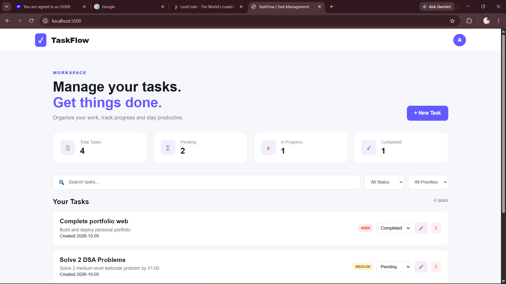

# TaskFlow
[](https://taskflow-ybys.onrender.com/)
[](https://github.com/anishydv2428/TaskFlow)

TaskFlow is a full-stack task management platform that helps users create, organize, track, and manage their daily tasks.

## 🌐 Live Demo

[**Open TaskFlow →**](https://taskflow-ybys.onrender.com/)

## 📸 Preview



## 🚀 Features

- Create new tasks
- Edit existing tasks
- Delete tasks
- Update task status
- Set task priority
- Search tasks
- Filter by status
- Filter by priority
- Dashboard statistics
- Responsive design
- Persistent data storage
- RESTful API

## 🛠️ Tech Stack

### Frontend
- HTML5
- CSS3
- JavaScript

### Backend
- Node.js
- Express.js
- REST API

### Storage
- JSON-based persistent storage

## 📁 Project Structure

```text
TaskFlow/
│
├── public/
│   ├── index.html
│   ├── style.css
│   └── script.js
│
├── db.json
├── server.js
├── package.json
└── README.md